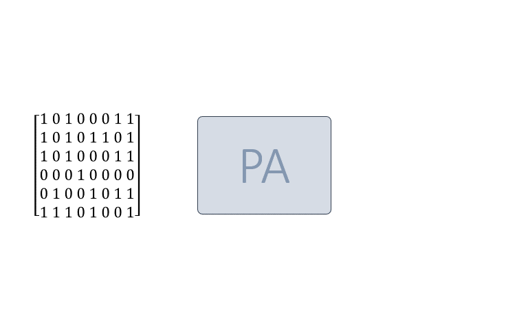
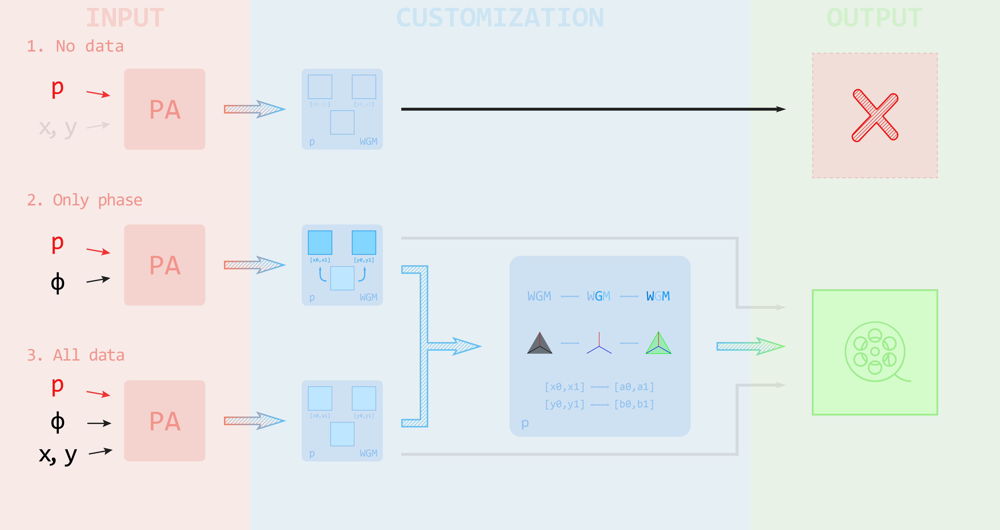
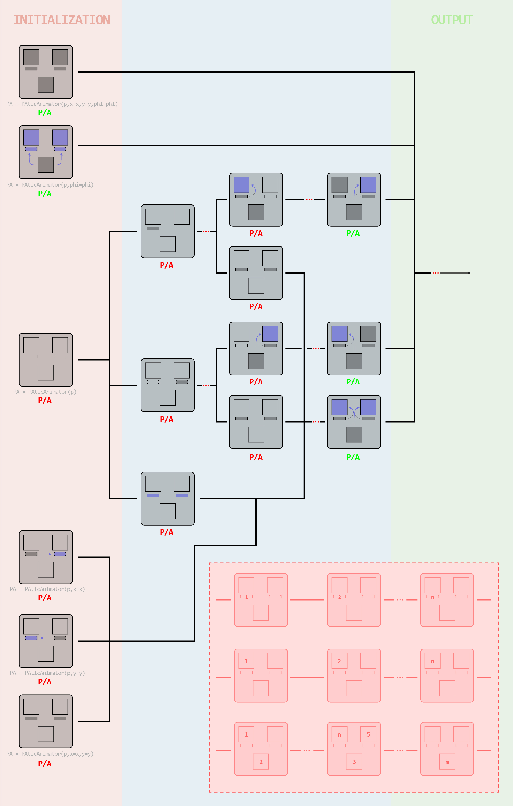
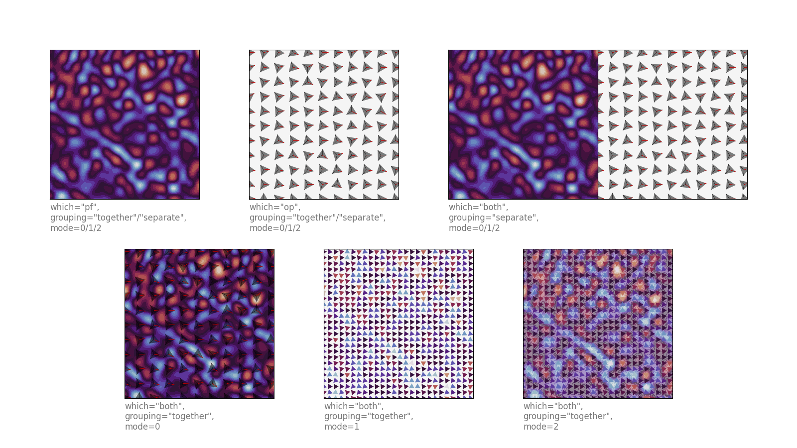
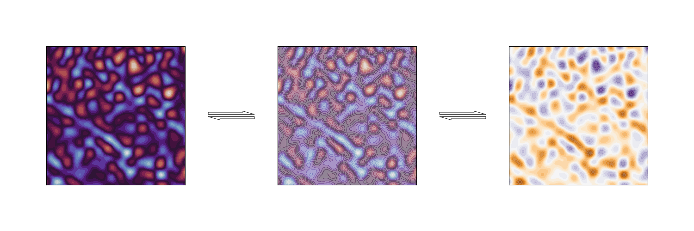
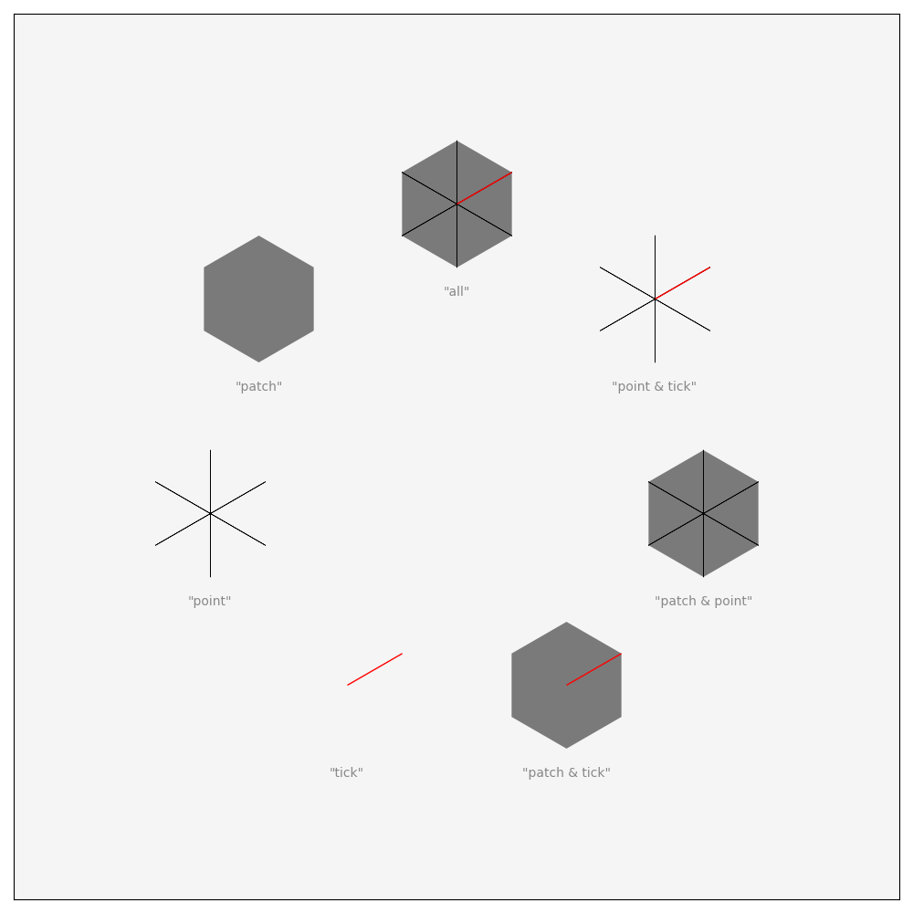
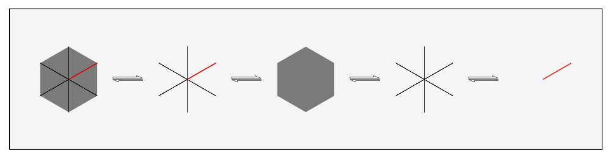
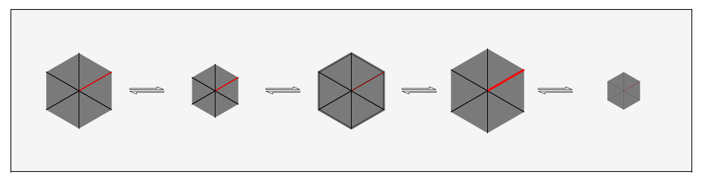
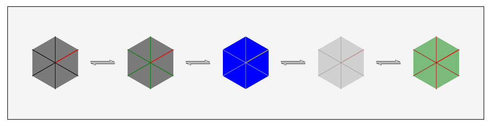
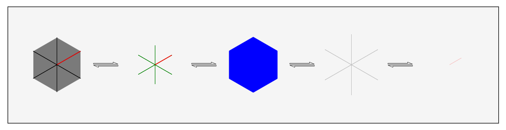

# PAticAnimator

*Python class for animating the time evolution of the P-atic order parameter and order parameter phase field.* 

*The idea is that once we are done with all of our calculations and we have computed the time evolution of the order parameter phase field, we can use this tool to make animations of the results.*

*The class imposes only one major requirement on the data, which is that the phase field array be 3-dimensional in order to be able to draw the frames for each time step. Otherwise, the tool is meant to be fairly customizable and flexible, particularly in terms of plot design.*

## Design

<figure>
    </img>
    <figcaption style="font-size:12px; font-style:italic; color:#d4d4d4">Fig. 1 PAticAnimator operating principle.</figcaption>
</figure>

The leading design principle behind the operation of this tool is quite simple, as illustrated in Fig. 1. The idea is that once we have computed the time evolution of the order parameter phase field by whatever numerical methods and tools we use, we can then use this tool to visualize the results. In other words, this is *not* a numerical/ computational tool, but merely a visualisational tool. As such, the PAticAnimator cannot compute the time evolution from some set of initial data, but instead needs to get the phase field data for each time step supplied in advance in order to be able to draw the frames for the animation. Therefore, there is a hard requirement on the format of the phase field array that is given as input to the animator during setup, as described in more detail below.

The tool is also designed to allow for fairly smooth workflow, which is illustrated in the figure below.

<figure>
    </img>
    <figcaption style="font-size:12px; font-style:italic; color:#d4d4d4">Fig. 2 Schematic representation of the PAticAnimator workflow.</figcaption>
</figure>

The class was designed such that the user can have as few steps as possible between initialization and output, while simultaneously having the possibility of customizing the plot design if desired.

In the most minimalist case, one could produce an animation in only two lines of code:

    >>> PA = PAticAnimator(p,phi=phi)
    >>> # Alternatively PA = PAticAnimator(p,x=x,y=y,phi=phi)
    >>> PA.animate()

This is illustrated by the solid black arrows in Fig. 2.

One could also initialize the animator without any data, in which case it would not be able to produce any output - indicated in the top row in the figure - until it is populated with the necessary data.

Beyond this, the animator allows for a good deal of customization of the plot design, as well as some degree of flexibility in terms of how it handles data. This will be described first, before moving to plot design in the **Customization** section.

## Input

The only mandatory input for the instantiation of a PAticAnimator class (”PA” in Figs 1 and 2) is p, indicated in red in Fig. 2.

The other inputs that can be given upon initialization - collectively termed “data” in Fig. 2 - are the x and y coordinates of the grid, as well as the computed phase field data. This can be done in a few different ways, as indicated in the left-most part of the diagram.

The animator places a restriction on the type and format of the phase field array in that it must be a 3-dimensional numpy array with shape $(n_t,n_y,n_x)$. This is a hard restriction as the whole class and the way it operates is designed around the phase field data.

There are much fewer restrictions in place for the coordinate data, which can be given to the animator in a number of different formats, as described at the end of this section.

#### 1. No data

The absolute bare minimum one needs to give PAticAnimator as input is the parameter p, in which case the instantiation of the animator object would look like this:

    >>> PA = PAticAnimator(p)
    >>> print(PA.x)
    None
    >>> print(PA.y)
    None
    >>> print(PA.phi)
    None

This requirement is in place in order to determine what kind of p-atic the object will be animating, primarily because p is used to determine the correct marker type in Matplotlib for the p-atic of interest.

If only p is given upon initialization, then the animator object carries no data - not the coordinate grids and not the phase field - hence the None outputs in the example above. This empty object can then be populated with data using the set_phi and set_grid methods.

For example, we could give the object a phase field array using the set_phi method  as follows:

    >>> PA.set_phi(phi)
    >>> print(PA.phi)
    [[[1.02352,...,30.21314]
    ...
    [3.65461,...,-1.36369]]
    ...
    [[-0.2352,...,53.13532]
    ...
    [63.0234,...,-35.2522]]]
    >>> print(PA.x)
    [[0,...,1]
    ...
    [0,...,1]]
    >>> print(PA.y)
    [[0,...,0]
    ...
    [1,...,1]]

In this case, if one supplies an empty animator only with phase field data, then it automatically constructs an appropriately shaped coordinate grid on the unit square in the xy-plane, so that one could in principle animate the results in the very next line after setting the phase field array, as in Example 1 above.

If it should matter what the coordinate grid is, then one can of course update it after setting the phase field data using the set_grid method:

    >>> PA.set_grid(x,which='x')
    >>> PA.set_grid(y,which='y')
    >>> PA.set_grid(c,which='both')

Any one of the lines above would update the coordinate grid data in the animator for either the x or y coordinate as in the first and second line respectively, or with a single range for both coordinates as in the third line.

Alternatively, one can also do this the other way around, and start with the coordinate data and then give the phase field array (which would be done using exactly the same lines of code as above). In this case, whatever the shape and content of the coordinate grids that one gives to the animator, it will only extract and store the end points of the intervals along the given coordinate axis and discard the rest of the data.

For instance, if we have a 2D array with an x coordinate grid with x in the interval $[-1,1]$, then giving this to the animator would result in:

    >>> PA.set_grid(x,which='x')
    >>> print(PA.x0)
    -1
    >>> print(PA.x1)
    1
    >>> print(PA.x)
    None
    >>> print(PA.y0)
    None
    >>> print(PA.y1)
    None
    >>> print(PA.y)
    None

We could also try setting the grid for both of the coordinates using the same array, in which case we would get

    >>> PA.set_grid(x,which='both')
    >>> print(PA.x0)
    -1
    >>> print(PA.x1)
    1
    >>> print(PA.x)
    None
    >>> print(PA.y0)
    -1
    >>> print(PA.y1)
    1
    >>> print(PA.y)
    None

The reason for this behaviour is quite simply that there is no way for the animator to know what the shape of the coordinate grid needs to be until the phase field array is given. Therefore, the best it can do is to store the coordinate ranges from the supplied coordinate data and construct the full coordinate grid with the appropriate shape and size automatically once the user gives the phase field data.

#### 2. Only phase field

Apart from p, one can also initialize a PAticAnimator object with the phase field array:

    >>> PA = PAticAnimator(p,phi=phi)
    >>> print(PA.x)
    [[0,...,1]
    ...
    [0,...,1]]
    >>> print(PA.y)
    [[0,...,0]
    ...
    [1,...,1]]
    >>> print(PA.phi)
    [[[1.02352,...,30.21314]
    ...
    [3.65461,...,-1.36369]]
    ...
    [[-0.2352,...,53.13532]
    ...
    [63.0234,...,-35.2522]]]

As in the above example, if only the phase field is given on initialization, then the animator will automatically construct a coordinate grid on the unit square in the xy-plane, so that one could immediately start plotting and visualising the phase field data. The coordinate grids can however be updated if that should be neccessary, which would be done in the same way as in Example 4.

#### 3. All data

Finally, one can supply all of the data at once in the initialization step - both the coordinate arrays and the phase field array, which would look something like:

    >>> PA = PAticAnimator(p,x=x,y=y,phi=phi)
    >>> print(PA.x0)
    -1
    >>> print(PA.x1)
    1
    >>> print(PA.x)
    [[-1,...,1]
    ...
    [-1,...,1]]
    >>> print(PA.y0)
    0
    >>> print(PA.y1)
    2
    >>> print(PA.y)
    [[0,...,0]
    ...
    [2,...,2]]
    >>> print(PA.phi)
    [[[1.02352,...,30.21314]
    ...
    [3.65461,...,-1.36369]]
    ...
    [[-0.2352,...,53.13532]
    ...
    [63.0234,...,-35.2522]]]

Like in the previous subsection, in this case the animator would also be ready to output an animation by calling PA.animate().

In all of the examples above, the x and y data can be given in a few different formats.

For example, the coordinate grids can be specified with tuples or lists of two elements that contain the endpoints of the coordinate intervals. In the initialization step, this would look like:

    >>> PA = PAticAnimator(p,x=[x0,x1],y=[y0,y1],phi=phi)
    >>> PA = PAticAnimator(p,x=(x0,x1),y=(y0,y1),phi=phi)
    >>> PA = PAticAnimator(p,x=(x0,x1),y=[y0,y1],phi=phi)
    >>> PA = PAticAnimator(p,x=[x0,x1],y=(y0,y1),phi=phi)

This would initialize the object with the grid being on the rectangle $[x_0,x_1]\times[y_0,y_1]$ with the correct number of points, as determined by the shape of the phase field array.

Likewise, the set_grid method also accepts two element tuples or lists:

    >>> PA.set_grid([c0,c1],which='x')
    >>> PA.set_grid([c0,c1],which='y')
    >>> PA.set_grid([c0,c1],which='both')

Alternatively, one can also initialize PAticAnimator with grid coordinates given as either 1D or 2D numpy arrays, with the syntax being the same as in the examples above.

If a coordinate is given as a 1D array that doesn’t have the size $n_x$/ $n_y$, then only the endpoints will be extracted, and the intermediate points will be constructed by the animator to match the shape of the phase field array. Likewise for a 2D array.

The discussion above is summarized in Figure 3 below. The next section goes into details on the customization of the animator object in terms of plot design.

<figure>
    </img>
    <figcaption style="font-size:12px; font-style:italic; color:#d4d4d4">Fig. 3 Flowchart of all of the different ways in which the phase field and grid data can be added to the animator object, and how it handles the data at various stages of the setup process. The big squares represent the animator object at any given stage of the process, with the left-most column in the chart representing all the ways in which PAticAnimator can be instantiated, with the corresponding lines of code shown in gray below each of the squares. The top two squares within the animator represent the x and y coordinate grids, while the square at the bottom represents the phase field grid. The two bracket-like symbols below the coordinate grid squares represent the intervals of the corresponding coordinate axes. Areas that are filled in with color represent the field being populated with data, with black representing data supplied by the user, while blue color represents the field being automatically populated by the animator based on the data given by the user. At any stage of the setup process, existing data in the animator can be updated and re-updated as many times as one desires, which is illustrated by the red insert in the lower right part of the figure which fits into the main flowchart wherever there are red dots in the lines. The “P/A” below the main squares indicates whether or not the animator object is ready for outputting anything through either the preview or animate methods as described below, with green indicating that it is ready and pink indicating that it isn’t.</figcaption>
</figure>

## Customization

PAticAnimator allows for a number of different plot configurations which enables the user to tailor the animations and plots in a way that is most prudent for a given situation. Depending on what the user wants or needs, the phase field data can be used to plot either the phase field itself, the corresponding order parameter field or both. The class allows one to do this in five different plotting configurations, which are shown in the figure below.

<figure>
    </img>
    <figcaption style="font-size:12px; font-style:italic; color:#d4d4d4">Fig. 4 All of the possible plotting configurations of PAticAnimator.</figcaption>
</figure>

The plotting configurations can be set using the set_which, set_grouping and set_mode methods, with the current configuration being stored in the which, grouping and mode attributes (indicated by “WGM” in Fig. 2). The values corresponding to each configuration are indicated below the respective plots in Fig. 4. By default, these attributes are set to

    >>> PA = PAticAnimator(p,x=x,y=y,phi=phi)
    >>> print(PA.which)
    pf
    >>> print(PA.grouping)
    together
    >>> print(PA.mode)
    0

where pf stands for the phase field. The other possible values for each of the attributes can be found in the main class doc string at the end of this document or seen in Fig. 4.

The grouping and mode attributes (and the corresponding methods for setting these) only do anything if the which attribute is set to ‘both’, in other words when plotting both the phase field and the order parameter, otherwise these are ignored. Likewise, the mode attribute is ignored when plotting the phase field and order parameter in separate plots (i.e. when which is set to ‘both’ and grouping to ‘separate’).

Upon initialization, the animator object will automatically have a figure (fig) and axis (ax1) attribute, which are simply instances of the Matplotlib Figure and Axes classes respectively. If the animator is configured to plot the order parameter and phase field in two separate coordinate systems, then it will also have a second Axes instance stored in the attribute ax2. Otherwise this attribute is set to None (which is its default value). The figure and axes attributes can be manipulated just like any other Matplotlib Figure and Axes instances, as described in the Matplotlib documentation.

Apart from the plotting configuration, PAticAnimator also allows for customization of both the phase field contour plot and the order parameter markers, which is discussed next.

### Phase field contour plot

<figure>
    </img>
    <figcaption style="font-size:12px; font-style:italic; color:#d4d4d4">Fig. 5 Customization of the phase field contour plot.</figcaption>
</figure>

The phase field contour plot can be customized in a few simple ways, as indicated in Fig. 5.

The user can set the contour plot transparency, using the set_pf_transparency method:

    >>> PA.set_pf_transparency(alpha)

where alpha is a float between 0 and 1, with 0 corresponding to completely transparent and 1 being to completely opaque.

One can also change the color map of the contour plot (and correspondingly of the order parameter markers in modes 1 and 2 when plotting the order parameter and phase field in the same coordinate system) using the set_colormap method:

    >>> PA.set_colormap(colormap)

The argument that is passed to the method can either be a string with the name of any of the standard Matplotlib color maps, or it can be an instance of a Matplotlib color map object.

Additionally, one can also affect the look of the contour plot by changing the background color of the axes. This is particularly useful when the contour plot is semi-transparent and/ or the order parameter markers are too sparse or too small to see with the default background color of the axes (see for example Figures 17-19).

These changes can be made at any stage of the setup process, either before or after setting the grid and phase field data.

### Order parameter markers

The order parameter can be plotted with a number of different marker types that can be set by the user. PAticAnimator allows for seven different marker types which are shown in the figure below, with the corresponding names shown in gray below each respective marker.

<figure>
    </img>
    <figcaption style="font-size:12px; font-style:italic; color:#d4d4d4">Fig. 6 All of the possible marker types in PAticAnimator with their corresponding names in the class shown in gray.</figcaption>
</figure>

The marker type can be set and reset any number of times using the set_marker_type method:

    >>> PA.set_marker_type(marker_type)

where marker_type is a string with any of the names shown in Fig. 7.

<figure>
    </img>
    <figcaption style="font-size:12px; font-style:italic; color:#d4d4d4">Fig. 7 Customization of marker type.</figcaption>
</figure>

In addition to marker type, one can also set the line width for any of the three basic marker types (patch, point and tick) individually using the set_marker_linewidth method:

    >>> PA.set_marker_linewidth(lw,which=marker)

where lw is a non-negative float and marker is a string with the name of the basic marker type one wishes to set the line width for. 

<figure>
    </img>
    <figcaption style="font-size:12px; font-style:italic; color:#d4d4d4">Fig. 8 Customization of marker size and linewidths.</figcaption>
</figure>

Additionally one can also set the size of the markers. However, this can only be done for all three marker types at the same time, with no possibility of affecting the sizes of the individual basic markers. The size can be set using the set_marker_size method:

    >>> PA.set_marker_size(ms)

where ms is a non-negative float.

Now, because the typical grid in our numerical calculations consists of 128-256 points in each dimension, there is a potential problem in using the same phase field array to plot the order parameter field, namely that there are too many points in the array to produce anything useful if every single point is to be displayed. The PAticAnimator solves this by slicing through the phase field array when plotting the order parameter, displaying only a subset of all the points in the array.

For this reason, the class also allows the user to set the density of markers as a fraction of the number of points along each dimension. This can be done using the set_marker_density method:

    >>> PA.set_marker_density(density,direction=direction)

where density is a float between 0 and 1, and direction can be one of ‘x’, ‘y’ or ‘both’.

The marker size will then be automatically adjusted according to the number of markers along the dimension with the greatest number of markers.

<figure>
    </img>
    <figcaption style="font-size:12px; font-style:italic; color:#d4d4d4">Fig. 9 Customization of marker color and opacity.</figcaption>
</figure>

One can also affect the marker color and transparency, which can also be done for any of the three basic marker types individually. This is done using the set_marker_color and set_marker_transparency methods:

    >>> PA.set_marker_transparency(alpha,which=marker)
    >>> PA.set_marker_color(color,which=marker)

where again marker is a string with the name of the basic marker type one wishes to affect, and alpha is a float between 0 (completely transparent) and 1 (completely opaque). The color argument can be any Matplotlib-compatible color string or RGB(A) tuple.

<figure>
    </img>
    <figcaption style="font-size:12px; font-style:italic; color:#d4d4d4">Fig. 10 Customization combined of all of the above.</figcaption>
</figure>

All of these aspects of the order parameter markers can of course be affected for one and the same plot, as indicated in Fig. 10, as much as the user should desire, and at any stage of the animator setup between initialization and final call to output.

If one should wish to see what the plot looks like without having to wait for the animator to produce the whole animation, then one can use the preview method to display a single frame of the animation. This method also accepts a frame keyword argument which allows the user to preview any particular frame of the animation if that should be desired or necessary (the details can be found in the main class doc string at the end of the document).

## Output

All of the animations below were produced on 256x256 grids with 101 time steps, with an average script run time of 44.4 seconds. The data for the animations is just dummy data that was made by superimposing 50 sine waves with random amplitudes, wave numbers and frequencies.

<figure>
    </img>
    <figcaption style="font-size:12px; font-style:italic; color:#d4d4d4">Fig. 11 The phase field contour plot as produced by the default settings of PAticAnimator.</figcaption>
</figure>

<figure>
    </img>
    <figcaption style="font-size:12px; font-style:italic; color:#d4d4d4">Fig. 12 Order parameter plot for a nematic with default marker type.</figcaption>
</figure>

<figure>
    </img>
    <figcaption style="font-size:12px; font-style:italic; color:#d4d4d4">Fig. 13 Order parameter plot for a 3-atic with default marker type.</figcaption>
</figure>

<figure>
    </img>
    <figcaption style="font-size:12px; font-style:italic; color:#d4d4d4">Fig. 14 Phase field and order parameter for a nematic produced in the same animation. The order parameter markers are the default markers of the PAticAnimator. Similar plots can be made for any value of p.</figcaption>
</figure>

<figure>
    </img>
    <figcaption style="font-size:12px; font-style:italic; color:#d4d4d4">Fig. 15 Nematic order parameter with default marker type plotted over the order parameter phase field contour plot.</figcaption>
</figure>

<figure>
    </img>
    <figcaption style="font-size:12px; font-style:italic; color:#d4d4d4">Fig. 16 3-atic order parameter with default marker type plotted over the order parameter phase field contour plot, this time with a different color map from the default one.</figcaption>
</figure>

<figure>
    </img>
    <figcaption style="font-size:12px; font-style:italic; color:#d4d4d4">Fig. 17 Nematic order parameter color mapped to the phase field values at every point. The background color of the axes changed to black from the default gray color as in Figs 2, 3 and 4.</figcaption>
</figure>

<figure>
    </img>
    <figcaption style="font-size:12px; font-style:italic; color:#d4d4d4">Fig. 18 3-atic order parameter color mapped to the phase field values at every point. The background color of the axes changed to black from the default gray. Color map is also changed from the default one.</figcaption>
</figure>

<figure>
    </img>
    <figcaption style="font-size:12px; font-style:italic; color:#d4d4d4">Fig. 19 Nematic order parameter color mapped to the phase field values at every point with a semi-transparent phase field contour plot in the background to emphasize the evolution of the phase field. Background axes color changed to black from the default gray.</figcaption>
</figure>

<figure>
    </img>
    <figcaption style="font-size:12px; font-style:italic; color:#d4d4d4">Fig. 20 3-atic order parameter color mapped to the phase field values at every point with a semi-transparent phase field contour plot in the background to emphasize the evolution of the phase field. Color map changed from the default one.</figcaption>
</figure>

## Main class doc string

The main class doc string, that can be accessed from a script by running

    >>> print(PAticAnimator.__doc__)

is shown below.

    '''
    Class for animating the time evolution of the order parameter phase field.

    The structure of the class is based around the phase field array, which is the one parameter
    on which the class makes a hard requirement in that it must be given as a 3D array with shape
    (nt,ny,nx), where nt is the number of time steps in the evolution - or in the context of the
    animation, the number of frames - while nx and ny are the number of points along each of the
    coordinate axes. These parameters are used to construct the coordinate grids for the plots,
    as well as the animation itself.

    Apart from these requirements, the class is made to be fairly flexible in terms of how the data
    is handled - in what order the various parameters can be given and in what format, and also in
    terms of plot design, allowing for styling the phase field colormap and transparency, order
    parameter marker type, marker color, marker size, and more.

    Initialization

    Positional arguments:
        p: int
            Determines what kind of p-atic the animator will be animating. Used to determine the
            correct marker for the order parameter plots.

    Keyword arguments:
        phi: 3D array || (default: None)
            Phase field data used to draw the frames of the animation, as well as to determine
            the size of the coordinate grids.

            The phase field array can be updated with the class method set_phi (details below) at
            any point up until the call to make the animation is made.

        x, y: tuple, list, array || (default: None)
            The coordinate grids can be set by giving the animator a tuple or list containing the
            upper and lower limits for the respective coordinate axes.

            Alternatively, the grids can also be set with 1D or 2D arrays. Unless the array shapes
            match that of the phase field array along the last two axes, the animator will
            construct a brand new grid using the max and min values from the supplied arrays as the
            axis limits for the respective coordinate.

            If only one of the coordinates is given, then both coordinates will automaically be set
            to the same values.

            If the coordinates are given, but the phase field array isn't, then the animator will
            only extract the limits of the coordinate axes, discarding the rest of the input data.
            The full coordinate grid will then be constructed from the limits once the phase field
            array is supplied.

            If no coordinates are given, but the phase field array is given, then the animator will
            automatically construct a default grid on the unit [0,1]x[0,1] square.

            The coordinate grids can be updated with the class method set_grid (details below) at any
            point up until the call to make the animation is made.

    Class Attributes
        p: int
            The degree of the p-atic order parameter. Used to determine the correct marker type for
            the order parameter plots.

        x0: float || (default: None)
            Lower limit of the x-coordinate in the coordinate grid.

        x1: float || (default: None)
            Upper limit of the x-coordinate in the coordinate grid.

        nx: int || (default: None)
            Number of points in the grid along the x-axis. Determined by the shape of the phase
            field array.

        x: 2D array || (default: None)
            x-coordinate grid. Defaults to None until the coordinate grid is fully constructed as
            described above (see also the set_grid class method).

        y0: float || (default: None)
            Lower limit of the y-coordinate in the coordinate grid.

        y1: float || (default: None)
            Upper limit of the y-coordinate in the coordinate grid.

        ny: int || (default: None)
            Number of points in the grid along the y-axis. Determined by the shape of the phase
            field array.

        nt: int || (default: None)
            Number of time steps in the time evolution of the phase field. Determined by the
            shape of the phase field array.

        y: 2D array || (default: None)
            y-coordinate grid. Defaults to None until the coordinate grid is fully constructed as
            described above (see also the set_grid class method).

        phi: 3D array || (default: None)
            Phase field array.

        which: str || 'pf' | 'op' | 'both' | (default: 'pf')
            Determines which of the phase field and order parameter to plot.
              'pf' - phase field,
              'op' - order parameter,
            'both' - phase field and order parameter.

        grouping: str || 'separate' | 'together' | (default: 'together')
            Determines how the order parameter and phase field are to be grouped in the figure.
            Only affects the plot if the which attribute is set to 'both', otherwise grouping is
            ignored.
            'separate' - plots the phase field and order parameter in each their own axes in the
                         figure,
            'together' - plots the phase field and order parameter in the same axes.

        mode: int || 0 | 1 | 2 | (default: 0)
            Determines the plot style if the phase field and order parameter are plotted together,
            in other words, when the which attribute is set to 'both' and the grouping attribute is
            set to 'together'. Otherwise, mode is ignored.
            0 - plots the order parameter in solid color over the phase field contour plot,
            1 - plots the order parameter with markers color mapped by the appropriate value of the
                phase field over a solid background,
            2 - plots the order parameter with markers color mapped by the appropriate value of the
                phase field over a semi-transparent phase field contour plot.

        fig: Matplotlib figure
            The figure where the plot is drawn. This attribute can be manipulated just like a
            regular matplotlib.figure object.

        ax1: Matplotlib axes
            The main axes of the figure. This attribute will always contain a matplotlib.axes
            instance, regardless of how the plot (which, grouping, mode attributes) is set up.

        ax2: Matplotlib axes || (default: None)
            This attribute will only contain a matplotlib.axes instance when plotting the phase
            field and order parameter separately (i.e. when which='both', grouping='separate').

            Both the ax1 and ax2 attributes can be manipulated like all other Matplotlib axes
            instances.

        colormap: str, Matplotlib color map || (default: 'twilight')
            Determines the color map for the phase field contour plot and order parameter markers
            where relevant. Can either be given as a Matplotlib color map name (str) or as a
            Matplotlib color map object.

        pf_transparency: float || (default: 1.0)
            Phase field contour plot transparency.

            This can be set either by using this parameter or by using the set_pf_transparency
            method as described below.

        marker_density_x: float || (default: 0.1)
            Determines the density of markers along x-direction as a fraction of the number of
            points in the x-coordinate.
        
        marker_density_y: float || (default: 0.1)
            Determines the density of markers along y-direction as a fraction of the number of
            points in the y-coordinate.

        marker_type: str || 'patch' | 'point' | 'tick' | 'patch & point' | 'patch & tick' | 'point & tick' | 'all' | (default: 'all')
            Sets the order parameter marker type.
            'patch' - regular polygon of order p for p >= 3. For p < 3, the marker becomes
                      a point that is not visible in the plot,
            'point' - regular asterisk of order p for p >= 3. For p = 2, the marker becomes
                      a straight line, as is appropriate for a nematic,
             'tick' - a single dash used to mark where the phase field is considered to be
                      zero,
              other - the other allowed values for the marker_type attribute result in some
                      combination of the three basic marker types described above.
            The marker type can be set either by using this attribute or by using the
            set_marker_type method as described below.

        marker_size: int, float || (default: 500)
            The size of the order parameter markers. This parameter determines the size for all
            three of the basic marker types. There is no way to change their sizes individually.

            The marker size can be set either by using this attribute or by using the
            set_marker_size method as described below.

        marker_colors: dict{'marker_name':Matplotlib color} || (default: 'patch':'k', 'point':'k', 'tick':'r')
            Contains the colors for the three basic order parameter markers.

            The marker color can be set either by using this attribute or by using the
            set_marker_color method as described below. The values that are accepted for the color
            are same as those accepted by Matplotlib.

        marker_linewidths: dict{'marker_name':float} || (default: 'patch':0, 'point':0.2, 'tick':0.5)
            Contains the linewidth values for each of the three basic order parameter markers.

            The marker linewidths can either be set using this attribute or by using the
            set_marker_linewidth method as described below.

        marker_transparencies: dict{'marker_name':float} || (default: 'patch':0.5, 'point':1.0, 'tick':1.0)
            Contains the transparency values each of the three basic markers.

            The marker transparency values can be set either by using this attribute or by using
            the set_marker_transparency method as described below.

    Class Methods
        set_grid(c,which='both')
            Sets up the coordinate grid(s) for the plot. If this method is called before the user
            supplies any phase field data, then only the limits of the coordinate intervals will be
            extracted from the input while the rest of the data is discarded. The full grid will then
            be constructed automatically from the limits once the user supplies the phase field array.

            Positional arguments:
                c: tuple, list, array
                    c can be given as a tuple or list with two elements defining the range(s) for the
                    given coordinate axis.

                    Alternatively, c can also be given as a 1D or 2D numpy array, in which case the
                    coordinate grid will be constructed directly from these.

            Keyword argumets:
                which: str || 'x' | 'y' | 'both' | (default: 'both')
                    Determines which of the coordinate axes the given input is for.

                       'x' - sets the x-coordinate grid,
                       'y' - sets the y-coordinate grid,
                    'both' - sets the same coordinate grid for both the x- and y-axes.

        set_phi(data)
            Sets the phase field data. If there are any pre-existing coordinate limits in the animator
            object, then supplying the phase field data will automatically construct the corresponding
            coordinate grid(s) from these limits. Otherwise, the method will construct a default grid
            on the unit square [0,1]x[0,1].

            This method can also be used to completely change a pre-existing phase field array to a new
            one. In that case, the new phase field array doesn't need to be of the exact same shape as
            the old one (although its shape must still be of the form (nt,ny,nx)). The coordinate grids
            will automatically be adjusted to match the shape of the phase field array along the last
            two axes.

            Positional arguments:
                data: array
                    The phase field data must be given as a 3D array with shape (nt,ny,nx).

        set_which(which)
            Determines whether to plot the phase field, order parameter or both.

            The default setting for which is 'pf'.

            Positional arguments:
                which: str || 'pf', 'op', 'both'
                      'pf' - phase field,
                      'op' - order parameter,
                    'both' - phase field and order parameter.

        set_grouping(grouping)
            Determines how to group the phase field and order parameter plots. This method only has
            effect if the which='both' (see also the main class doc string). Otherwise the grouping
            parameter is ignored.

            The default setting for grouping is 'together'.

            Positional arguments:
                grouping: str || 'separate', 'together'
                    'separate' - plot the phase field and order parameter in each their own coordinate
                                 system,
                    'together' - plot the phase field and order parameter in the same coordinate
                                 system.

        set_mode(mode)
            Sets the plotting mode when plotting both the phase field and order parameter (i.e. when
            which='both'). This method only has effect if the grouping is set to 'together'.
            Otherwise the mode parameter is ignored.

            If the mode is changed to 1 or 2 (with which='both' and grouping='together'), then this
            method will automatically change the marker type to the default for those two modes, and
            will override the set_marker_type method if it is called before set_mode. However, the
            marker type can still be changed by changed by calling set_marker_type after changing the
            mode. The same goes for the marker transparencies.

            Likewise for the patch marker color - changing the mode to 1 or 2 will automatically set
            the patch marker color to the phase field color map with no possibility of changing this
            (the point and tick colors can still be changed as desired, though this must also be done
            after calling set_mode in order to have any effect).

            The default setting for mode is 0.

            Positional arguments:
                mode: int || 0, 1, 2
                    0 - plot the order parameter with solid colored markers over phase field,
                    1 - plot the order parameter with the phase field values color mapped to each
                        marker,
                    2 - plot the order parameter with the phase field values color mapped to each
                        marker over semi-transparent phase field.

        set_marker_density(density,direction='both')
            Sets the density of markers along either x- or y-axis, or both simultaneously. If called
            without a defined coordinate grid in the specified direction, then the method will have
            no effect.

            Positional arguments:
                density: int, float || (0,1]
                    Determines the marker density along the direction specified by the direction
                    keyword argument.

            Keyword arguments:
                direction: str || (default: 'both')
                    Specifies the direction along which the given density should apply.

                    If the direction is set to 'both' without a fully defined coordinate grid, then the
                    marker density will be set only for the direction for which the coordinate grid is
                    defined.

        reset_marker_settings()
            Resets the marker type, color, transparency, size and linewidths to the default values for
            any given plotting configuration.

        set_marker_type(marker_type)
            Sets the marker type for the order parameter markers.

            If the plotting mode is changed to 1 or 2 (with which='both' and grouping='together')
            from any of the other plotting configurations, then this method will have no effect on the
            marker type if it is called before set_mode, since set_mode sets a default marker type for
            the modes 1 and 2 (see also the set_mode doc string).

            Positional arguments:
                marker_type: str || 'patch', 'point', 'tick', 'patch & point', 'patch & tick', 'point & tick', 'all'
                    'patch' - regular polygon of degree p for p >= 3. p < 3 gives just a point which is
                              not visible in the final plot,
                    'point' - regular asterisk of degree p for p >= 3. For p = 2, the marker just
                              becomes a line, as is appropriate for a nematic,
                     'tick' - single dash used to mark where the phase field is considered to be zero
                      other - all the other allowed values for the marker_type set any combination of
                              the three basic marker sub-types.

        set_marker_color(color,which="patch")
            Sets the color for any of the three marker sub-types.

            This method will have no effect on the patch color in the modes 1 and 2 (with which='both'
            and grouping='together') as the patch color will be set to the phase field color map in
            those modes.

            Positional arguments:
                color: any Matplotlib-compatible color

            Keyword arguments:
                which: str || 'patch' | 'point' | 'tick' | (default: 'patch')
                    Determines which of the marker sub-types the color should apply to.

        set_marker_size(size)
            Sets the size of the order parameter markers. The same size is set for all three of the
            marker sub-types at once with no option of affecting each one individually.

            By default, the marker sizes are set automatically based on the marker density, but this
            can be overwritten using this method.

            Positional arguments:
                size: float, int
                    Sets the marker size.

        set_marker_linewidth(linewidth,which="point")
            Sets the linewidth for any of the three basic marker sub-types.

            If p = 1,2, then by default the marker linewidtsh will be set automatically based on the
            marker density, but this can be overwritten using this method.

            Positional arguments:
                linewidth: float

            Keyword arguments:
                which: str || 'patch' | 'point' | 'tick' | (default: 'point')
                    Determines which of the basic marker sub-types the linewidth should apply to.

        set_marker_transparency(alpha,which="patch")
            Sets the transparency for any of the three basic marker sub-types. The effects of this
            method will be overwritten by the set_mode method if the mode is changed to 1 or 2 (with
            which='both' and grouping='together') from any other plotting configuration. The
            transparency can be set to any desired value by calling this method after set_mode
            (see also the set_mode doc string).

            Positional arguments:
                alpha: float
                    Transparency value. Because the transparency must be a number in the interval
                    [0,1], if alpha is greater than 1, the transparency will be set to 1.

            Keyword arguments:
                which: 'patch' | 'point' | 'tick' | (default: 'patch')
                    Determines which of the marker sub-types the transparency should apply to.

        set_colormap(colormap)
            Sets the color map for the phase field contour plot and order parameter markers where
            relevant.

            Positional arguments:
                colormap: str, Matplotlib colormap
                    The colormap can be given as a string with the name of any of the standard
                    Matplotlib colormaps, or as a Matplotlib colormap object.

        set_pf_transparency(alpha)
            Sets the transparency of the phase field contour plot. Calling this before set_mode will
            have no effect on the phase field contour plot transparency, as the set_mode method sets
            a default value for the transparency. However, calling the method after set_mode will set
            the transparency to the desired value.

            Positional arguments:
                alpha: float
                    Transparency value. Because the transparency must be a number in the interval
                    [0,1], if alpha is greater than 1, the phase field transparency will be set to 1.

        preview(frame=None)
            Allows the user to preview a single frame of the animation.

            Keyword arguments:
                frame: int || (default: None)
                    Determines which frame of the animation to preview. If frame > nt, it will simply
                    be set to nt-1.

        animate(address='.')
            Makes the animation of the phase field/ order parameter time evolution and saves it to the
            user-supplied address.

            Keyword arguments:
                address: 'str' || (default: '.')
                    Sets the adress for where to save the animation. The address can be given as a
                    relative link (the default adress is simply the same folder as the script from
                    which the animation is being made) or as an absolute link.
    '''

The doc strings for each method can also be accessed individually. For example,

    >>> print(PAticAnimator.set_grid.__doc__)

will produce

    '''
    Sets up the coordinate grid(s) for the plot. If this method is called before the user
    supplies any phase field data, then only the limits of the coordinate intervals will be
    extracted from the input while the rest of the data is discarded. The full grid will then
    be constructed automatically from the limits once the user supplies the phase field array.

    Positional arguments:
        c: tuple, list, array
            c can be given as a tuple or list with two elements defining the range(s) for the
            given coordinate axis.

            Alternatively, c can also be given as a 1D or 2D numpy array, in which case the
            coordinate grid will be constructed directly from these.

    Keyword argumets:
        which: str || 'x' | 'y' | 'both' | (default: 'both')
            Determines which of the coordinate axes the given input is for.

                'x' - sets the x-coordinate grid,
                'y' - sets the y-coordinate grid,
            'both' - sets the same coordinate grid for both the x- and y-axes.
    '''